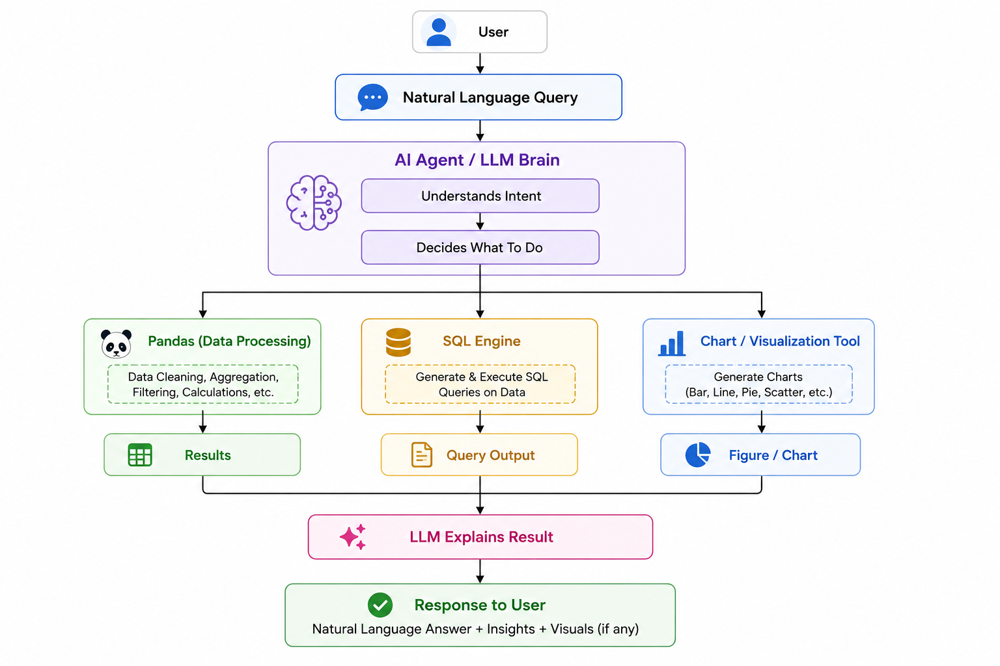

# AI-Powered Data Analyst

A production-style full-stack data analyst app for uploading CSV files and asking natural-language questions. It validates data, profiles datasets, generates Pandas and DuckDB-style SQL, detects anomalies, creates charts, preserves session context, and can use Groq for LLM explanations.

## Features

- Upload and validate one or more CSV files
- Ask natural-language business questions
- Generate summaries, insights, reasoning steps, SQL, and Pandas snippets
- Render bar, line, pie, and scatter charts
- Detect numeric anomalies and explain why rows were flagged
- Analyze multiple files together by joining on shared columns or stacking files when no join key exists
- Generate a dashboard with KPIs, charts, and insights
- Export a Markdown analysis report from the current session
- Maintain per-session conversation context
- Docker Compose support
- Sample sales and customer datasets included


## Tech Stack

| Layer | Technology |
| --- | --- |
| Frontend | React + Vite + TypeScript |
| UI | Tailwind CSS + shadcn-style components |
| Charts | Recharts, Plotly-ready dependency |
| File Upload | React Dropzone |
| Backend | FastAPI |
| AI Framework | LangGraph-ready agent structure |
| LLM | Groq API |
| Data Processing | Pandas |
| SQL | DuckDB |
| Anomaly Detection | Scikit-learn-ready, z-score baseline |
| API | FastAPI REST |

## Setup

### Backend

```bash
cd backend
python -m venv .venv
.venv\Scripts\activate
pip install -r requirements.txt
copy .env.example .env
uvicorn app.main:app --reload
```

Set `GROQ_API_KEY` in `backend/.env` to enable live LLM explanations. Without it, the app runs in deterministic demo mode.

### Frontend

```bash
cd frontend
npm install
npm run dev
```

Open `http://localhost:5173`.

## Docker

```bash
set GROQ_API_KEY=your_key_here
docker compose up --build
```

Frontend: `http://localhost:5173`  
Backend health: `http://localhost:8000/health`

## Example Questions

- Which region generated the highest revenue?
- Show monthly sales trends.
- Which products are underperforming?
- What are the top five customers?
- Generate SQL for this analysis.
- Detect anomalies in the dataset.
- Create a dashboard from all uploaded files.

## Multi-File Analysis, Dashboards, and Reports

Upload multiple CSV files in one session. The backend creates a combined analysis frame by joining files on shared column names such as `customer` or `region`; if no shared columns exist, it stacks files with dataset provenance.

Use **Generate dashboard** in the sidebar to produce KPI cards, recommended charts, and dashboard insights. Use **Export report** to download a Markdown report containing dataset summaries, metrics, insights, recent conversation context, and generated chart references.

## Architecture


## Dashboard 1


## Dashboard 2


## Demo Video

[▶ Watch Demo](docs/Demo.mp4)